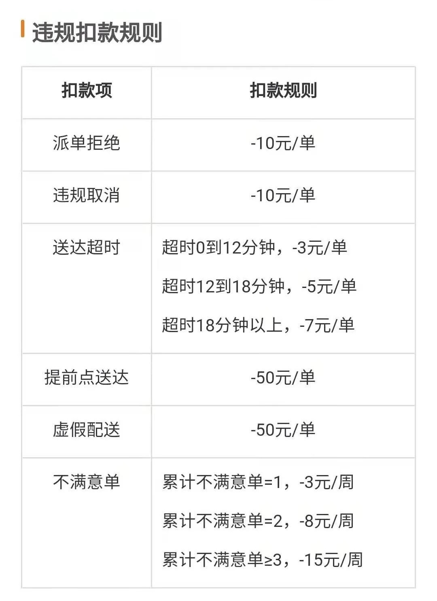
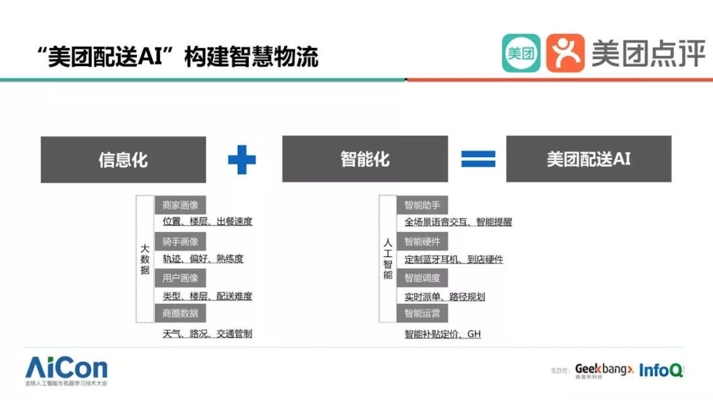

# 美团外卖平台案例研究
#### 小组成员
|学号|姓名|学号|姓名|学号|姓名|
|---|---|---|---|---|---|
| 1910130018 | 朱迪伦 | 1910130071 | 杨培君 | 1910130019 | 陈梓基 |
| 1910130068 | 肖亮书 | 1910130045 | 李嘉浩 | 1910130108 | 聂俊杰 |

-----

### A. 平台理论及对应中国案例分析成果与建议

#### 理论1：病毒式增长

> *病毒式增长，一种拉动式的过程，鼓励用户将平台传播给其他潜在用户。当用户自身鼓励他人加入网络时，这个网络就会变成自身增长的动力。*

**平台案例：组队拆红包活动**

| 发送者  | 价值单元 |  外部网络 |  接受者  |
|---|---|---|---|
| 下单后给其他人分享“组队拆红包”活动链接的用户 | “组队拆红包”活动中拆出来的红包 |  微信、QQ等社交平台 | 微信用户看到“组队拆红包”链接，点击并访问美团外卖app，使用该红包订购外卖。订购外卖后获得并分享“组队拆红包”的链接，开始循环上述过程，接受者变成发送者。 |

在平台发展前期，组队拆红包活动促进了平台的病毒式增长。但是在平台成熟时期，用户对该活动的规则已经有充足的了解，多数老用户和频繁使用平台的用户获得的红包金额较少、限制较多，组队拆红包中红包的价值已经大大减少，并且用户传播的圈子也趋于饱和（大多数人传播的圈子多集中于微信好友、朋友圈，而每个人的微信好友数都是有限的，随着时间的增长，可供传播的微信好友将会越来越少），病毒式传播的链条已经开始断开。

**案例建议**  

在价值单元方面，美团外卖可以重新选择其价值单元，以盘活其病毒传播活动。  
- 美团外卖可以借用短视频、宣传片或者其它的形式（例如：美团骑手的袋鼠耳朵装饰），融入企业文化制造正面社会热点或者有趣的平台话题，即“造梗”，让人们产生新鲜感，觉得有趣。  
- 人们会不由自足地对这些“梗”进行二次创作，平台可以在其内部提供大量与这些“梗”有关的活动或功能，方便用户制作和传播价值单元，并传播到外部网络，间接地为平台宣传，进一步引入更多的流量，提高平台的热度，实现进一步的病毒式增长。（例如：蜜雪冰城、屈臣氏）  

#### 理论2：市场失灵：垄断

> *在一个生态系统中，当一个供应商对某种公众所求的产品拥有足够大的供应权，并利用此权利提高价格或捞取其他好处时，垄断势力（monopolypower）就产生了。*

**平台案例：对消费者的控制———大数据杀熟**

根据部分用户反馈，自己在开通美团外卖会员之后，发现自己常点的店铺，配送费比平时贵。多家媒体也实测，在美团外卖平台上，不同的手机用户，其配送费用确实不一样，频道使用美团平台的用户，比新用户费用更高。同一家外卖，同一个配送位置，同一个下单时间点，在开通会员后，订单最后折扣价格比非会员用户高。  
  

**案例建议** 
 
1. 平台要树立诚信意识，不可恶意利用用户的忠诚度以及于用户之间的信息差去牟利;
2. 平台可以采取价格公示的方式，尽可能让价格透明化，让用户知晓平台制定价格的规则，这样用户就能及时发现不合理的定价;
3. “大数据杀熟”本质上是对市场公平性的蔑视，是对用户数据信息的滥用。用户要坚决抵制这种行为，遇到“杀熟”的现象，果断卸载或者举报，刺激平台主动改进;
4. 监管部门要加大对有“杀熟行为”平台的处罚力度，提高平台的“杀熟”成本。

#### 理论3：平台治理：劳动者权益

> *良好治理的目标是创造财富，并且将财富公平地分配给所有为平台创造价值的人。合理的统治生态系统比只顾自己的治理策略更重要。*

**平台案例：算法与骑手**

美团外卖的配送算法系统与“以罚代管”的方式对劳动者的权益并非有益。
- 算法被使用在骑手的配送接单与配送路线规划之中。算法会根据商家地址、顾客地址、骑手配送时间等因素规划出合理的、省时的最佳路线。算法在外卖平台中最初的目的或表面目的是减少顾客的等待时间与减少骑手不必要的劳动。算法的使用在本质上是外卖配送资源的优化配置。
- 算法的使用本身并没有问题，但当算法搭配上不合理的“以罚代管”方式时，算法就成为了资本不断汲取骑手剩余价值的工具了。骑手只要没有在算法预估的时间内送达外卖，便必然会面临平台的罚款。然而算法和系统并不会考虑到骑手在配送过程中可能遇到的一些意外情况，如：电梯的占用、顾客不接听电话、交通堵塞等。不管是什么原因导致的超时，都会先行罚款。尽管平台有事后反馈机制，但是其繁复步骤、消极处理及取证困难增加骑手维权的难度，更多的骑手选择放弃维权，通过接更多的配送单来弥补一次超时的损失，“自愿”增强自己的劳动强度。
- 同时，骑手为了避免超时的发生，只能在以更快的速度行驶和违反交通规则中不断缩减自己配送每一单的时间。但其代价便是骑手身心健康的受损以及生命安全的威胁，并且算法认为骑手的配送速度在不断地加快，使得下一轮骑手将以更少的时间配送更多单外卖。
- 如此一来，外卖每配送一单的劳动时间就在算法和罚款的双重作用下被迫缩短了。其的所宣称的“多劳多得”本质上还是资本逐利、压榨骑手的手段，仍需相应的监管。  

**案例建议** 

1. 优化算法，让算法能够根据配送路线上的路况、天气、红绿灯数量来预测配送的时长，如果预测时长会超过与用户约定的时长，则根据超出的时长来相应地给骑手延长配送时间，提升骑手的容错率，也减少骑手为了赶时间而在配送过程中出现违反交通规则的状况；
2. 对配送行为采取积分制，积分的多少关系到骑手接单的数量，积分多，能接的单就多，积分少，能接的单就少。骑手由于电梯占用、顾客不接电话等外在因素而导致超时，会先被扣除积分，才会采取罚款的措施，这样能够折中处理故意迟到和意外迟到的情况；
3. 为骑手提供配送记录设备，记录骑手的配送过程，让因遇到意外情况而迟到的骑手能够有证据去向平台反馈；
4. 平台可以利用宣传片、短视频、海报等传播形式，多向大众展现骑手的日常工作状况，让消费者了解到骑手的工作环境，主动引导他们去理解骑手的不易，鼓励他们尽量不要过分催单，对于骑手迟到的行为也尽量保持克制，不要过分辱骂、责怪骑手。 

#### 理论4：盈利化

> *盈利化最关键的选择就是决定该向谁收费，因为五花八门的平台用户所扮演的角色具有差异性，这意味着向这些用户收费会产生迥异的网络效应。*

**平台案例：以对骑手的罚款为收益**

事实上，对骑手不良行为的罚款也是美团外卖的收入来源之一。 美团外卖对骑手的奖赏机制并不平衡，因迟到等不良行为所罚款的金额大于因提前配送成功等良好行为所奖赏的金额，简单来说就是“罚多于奖”，再加上骑手本身收入不稳定，并且不是所有不良行为都是他们有意而为之（可能是因为一些外在因素，例如交通堵塞、电梯占用等等），这些高额的罚款会让许多骑手的处境雪上加霜。  

“美团模式“就是“外包模式”，将风险转化给第三者（例如人力资源公司、加盟商、站长），但第三者大多会为了“节约成本”，不愿意去维护骑手的利益。美团公司的毛利率的上升，会让一部分人的利润受损，而最先损失的就是外卖骑手的利润。         

**案例建议** 

1. 开拓更多的盈利化模式，持续压榨的骑手并非长久之计，要对美团的“外包模式”做出改变；
2. 平台要优化对骑手收益抽成的比例，骑手本身是无底薪的，平台要更好地保障骑手的收益，这样才能更好的留住活跃骑手；
3. 平台要改进自己的奖赏机制，特别是罚款的金额要重新进行相应的调整，不可占据骑手收入过多的比例。

---

### B. 大数据理论及对应中国案例分析成果与建议

#### 理论1：关联物：预测

> *在小数据世界中，相关关系也是有用的，但在大数据的背景下，相关关系大放异彩。通过应用相关关系，我们可以比以前更容易、更快捷、更清楚地分析事物。通过给我们找到一个现象的良好的关联物，相关关系可以帮助我们捕捉现在和预测未来；通过找出一个关联物并监控它，我们就能预测未来。*

**平台案例**

美团外卖在给骑手排单的时候使用了“美团配送AI”。在这个AI的使用中，首先要进行的是数据收集。  
  

> 举个例子，要收集到什么样的数据？我们要收集到一个商圈的数据，这个商圈可能要精细到小区和楼宇级别，一个楼在什么地方，这个小区是不是让骑手进来，同时还要收集天气数据，比如风速、温度，是否有雾霾，因为所有数据会影响到配送的效率，用户下单情况，比如今天雾霾，北京的外卖订单量估计会上涨。

在这个把现实状况信息化的过程中，所收集到的数据是预测骑手配送时间、分配骑手的关联物。这些数据将决定AI向哪位骑手分配那个商圈和小区的订单，也决定了骑手要以怎样的速度去配送。

尽管美团外卖在派单系统中使用了大数据和算法去优化配置外卖配送资源，但是根据骑手侧的反映，“美团配送AI”中的数据仍未很好地反映他们的工作所遇到困难，仍然很多的现实状况没有被数据化、没有与骑手派单相关联，导致骑手“困在系统中”，劳动状况极其不好。

**案例建议**  

对于骑手来说，美团的算法非但没有使他们的工作变得轻松，反而让他们的劳动状况变得更加糟糕，而要解决这个问题，“美团配送AI”对于数据的关联运用还需加强。
1. 美团可以在他们收集的海量数据中，筛选出大部分与骑手送货迟到，或者被客人投诉的，有关的各种状况。比如，当天的天气情况、骑手送货路上的交通情况等等，然后清除这些数据中收集成本高的数据，留下容易收集的以及与骑手送货密切相关的状况，作为预测骑手送货时间的“关联物”。
2. 美团将收集到的“关联物”转化为骑手送货时间的预测数据，例如雨天模型，大幅度增加配送时长，让小哥们能安心些、慢点骑。而随着收集到的“关联物”越来越多，美团就可以建立更多这种模型，合理安排骑手送货地点以及送货时间，减轻骑手的负担。

#### 理论2：风险：数据隐私
> 大数据的价值不再单纯来源于它的基本用途，而更多源于它的二次利用。大数据时代，很多数据在收集的时候并无意用作其他用途，而最终却产生了很多创新性用途。想在大数据时代用技术方法来保护隐私是天方夜谭，我们的个人隐私受到了威胁，个人信息可能被二次利用了。

> 在大数据时代，我们需要设立一个不一样的隐私保护模式，这个模式应该更着重于数据使用者为其行为承担责任，而不是将重心放在收集数据之初取得个人同意上。这样一来，使用数据的公司就需要基于其将对个人所造成的影响，对涉及个人数据再利用的行为进行正规评测。

**平台案例**

- 消费者在使用美团外卖点购外卖之前，需要向美团外卖提供其当前的地理位置。在下单时，消费者还需要向平台提供其姓名、性别、更详细的住址以及电话号码等敏感的个人信息。消费者每购买一次外卖就需要向平台、商家、骑手分享其个人信息。尽管这些信息对购买和配送外卖是至关重要的信息，但是如何在向各方提供这些信息的同时保障消费者的信息不被泄露或恶意利用是美团外卖需要考虑到的问题。
- 在美团外卖中，对消费者的电话号码是有一定的保护措施的，比如下单时的号码保护功能、在外卖单中电话号码的部分打码。但是实际上这样的服务还是需要消费者自行选择的。同时，在一些地区的商家还会要求消费者在下单时不要选择号码保护功能，称“以免联系不上消费者”。大部分消费者在权衡之后通常会取消选择号码保护，这样的措施仅能有限地保护数据隐私。
- 此外，在美团外卖App中选择号码保护后会提示“通话可能会被录音”。美团外卖解释称录音是用以处理服务纠纷的，平台会对录音进行技术分析。但消费者无法得知美团外卖方在分析录音处理服务纠纷的同时还有没有利用分析结果去进行其他消费者并不同意的行为。本意是保护消费者隐私的功能在使用的同时又造成了另一方面的隐私担忧，这同样需要美团外卖进一步细化改进。  

**案例建议**  

对于数据隐私的保护，最常用的一种技术就是匿名化，但是这仅仅只适用于小数据时代。
1. 在如今的大数据时代，美团可以采用“可控匿名”这一方法，即如果订单发生问题的时候，平台可以通过用户提供的信息找到用户并解决问题，而商家与骑手无法了解到用户的个人信息，只能通过平台进行解决，从而保障了用户合理的匿名交易和个人信息保护的需求。对于号码保护等用户信息的隐藏，可以在用户支付订单页面弹出温馨提示，为没有设置信息保护的用户提醒个人信息的保护。
2. 监管机制可以决定不同用户类型的个人数据必须删除的时间，美团平台对于所收集到的用户信息进行定时筛选删除，平台对于用户的数据既能有效利用，也能承担在特定时间之后删除用户个人数据的义务。通过过限制个人信息存储和处理的时间从而保护了个人隐私，也有效的防止数据被二次不合理利用。

---

### C. 大数据及平台两论点的整合度

| 议题  | 应用理论  | 实际做法  |
|---|---|---|
| 骑手权益的维护 |  **平台理论** （A.平台治理：劳动者权益 B.盈利化方式）  **大数据理论** （A.关联物：预测）   |  1.**优化算法，加强美团AI对于数据的关联运用**。通过收集、筛选天气、路况、客人投诉等数据，添加能够预测骑手送货时间的“关联物”，让算法能够智能分析骑手的配送状况，适当地为骑手延长配送时间，减少了骑手为了赶时间而违反交通规则的状况，减轻了骑手的工作压力； 2.由于算法始终是冰冷的工具，骑手也会遇到许多特殊的情况，算法并不能尽善尽美地为每一个骑手做到绝对公平的判定，所以为了让骑手能够更好地维权，可以**为骑手配备记录设备**，设备能够拍摄骑手工作的实况，如果骑手出现被误罚的情况，可以持有视频证据向平台反馈，这样也能为平台提供更多的“关联物”，从而促进“算法向善”的转变； 3. 除了技术上的改进，平台也要重视**在制度上保护骑手**。骑手是外卖行业链中的重要一环，美团外卖要开拓更多的盈利化模式，一味地通过压榨骑手，以骑手罚款为收益的盈利化模式无异于饮鸠止渴、竭泽而渔，并非长久之计。既要调整对骑手收益抽成的比例，也要改善“罚大于赏”的奖罚机制，调整罚款金额，使机制趋于平衡，这在一定程度也是对骑手权益的维护。|
| 实现平台的可持续性发展 |  **平台理论** （A.病毒式增长 B.市场失灵：垄断）  **大数据理论** （A.风险：数据隐私）  | 1.**平台的可持续性发展离不开新鲜血液的注入**，平台无论处于哪个发展阶段，都需要吸引更多的新用户加入，只是在不同阶段，采取的引流措施也要有所不同。为此，对于发展时间已久的美团外卖来说，比起发展初期的“组队拆红包”活动，美团外卖已经不能再满足于用堆钱的方式去积累新用户了，美团需要与时俱进，运用创新的思维去进行引流。美团可以借助当下短视频的热潮，也可以利用其它的创作形式，例如视频、宣传片等等，**创造属于美团外卖的、独特的“梗”**，在社交平台上掀起波澜，用火热的话题带动人们关注到美团外卖，实现新的病毒式增长； 2.在引流的同时，**平台也要重视老用户的去留**，不仅要引入新用户，也要留住老用户。**平台要重视对用户忠诚度的培养，而这种培养的成功与否在于平台能否给予用户安全感，能否获取用户的信任**。美团外卖“大数据杀熟”的行为对于老用户不仅是一种经济上的欺诈，也是情感上的伤害，虽然让新用户的费用低于老用户的费用能够很好地留住新用户，但新用户始终也会变成老用户，所以这种“杀熟行为”无异于是美团外卖**通过透支自身的信誉**来获利。与此同时，外卖会涉及到用户许多的个人信息及隐私，例如电话、住址、口味喜好等等，如果美团无法为用户的个人信息提供保护，用户将会失去安全感，可能会不再使用美团，久而久之，美团就会因此流失大量用户。 总而言之，美团需要**树立诚信意识**，不可利用用户的信任以及与用户之间的信息差来牟利，美团可以**采取价格公示的方式**，尽可能让价格透明化，让用户知晓平台制定价格的规则，尊重用户的知情权，并且在数据上，**采用“可控匿名”的方式**，保护用户的个人信息，对于所收集到的用户信息也可以进行**定时筛选删除**，承担保护用户信息的义务。做到诚信与负责两点，美团外卖就能够很好地给予老用户安全感，巩固老用户对于美团外卖的信任。